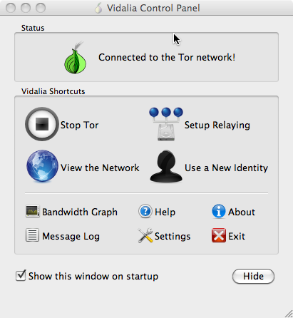
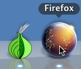
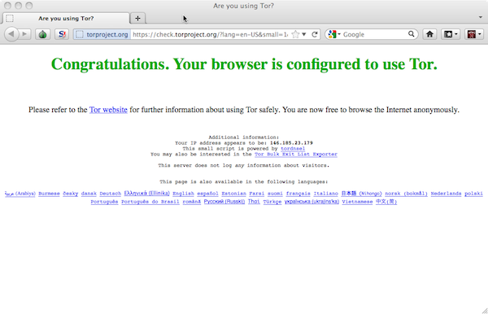

.. _online-submission:

=======================
Online Submission Guide
=======================

Are you a whistleblower interested in submitting documents to Honest Appalachia? This document will guide you through submitting a file to our secure upload site.

..  warning::
    Honest Appalachia's mission is to protect the identity of whistleblowers who use our site to share documents of interest to the public. Choosing to become a whistleblower can be a risky decision. We do not guarantee your identity will be protected.

You will need:

1.  A file or files to share with us
2.  A computer with internet access that you can install software on. Any common platform (Windows, Mac, Linux...) will work.

The secure submission process and this guide to it are designed to be easy to use no matter your technical skill level! If you run into problems, you can always :ref:`contact` for help.

If you are not comfortable with using or are unable to use the upload site, you can use our secure postal network to send us documents. Check out the :ref:`postal-submission` guide to learn how.

Before you begin
----------------

*Do not* make submissions or even access this site over corporate or organization networks. Your network traffic is almost certainly being logged, and if it is not being actively analyzed, it will be if leaked documents appear. Furthermore, many such networks block or ban the use of anonymization software like Tor, which is required to access our secure upload server.

Instead, copy the files to a hard drive, USB stick, or CD-ROM and use a personal computer to upload them from there to our website.

We don't recommend the use of public computers like those available at libraries or internet cafes for two reasons:

1.  You will need to install software, which is often disallowed on public computers
2.  It is impossible to know if a public computer contains malware or other malicious software that could potentially monitor your activity.

Use your own computer, or borrow a trusted friend's. 

Our secure upload process is designed to protect your anonymity over private or public networks. That means you can safely upload documents from your home computer, or you can use a public wifi network, like those available at coffee shops.

..  note::
    You might think that using a open wifi network would make it harder to track you, but the increased risks associated with using open wifi make it something of a wash. If you do use a public network, we recommend minimizing your physical presence and avoiding giving out personally identifying information: don't give your name, make any purchases with cash only, avoid security cameras, and so on. We also recommend only using the upload site and then disconnecting from the network and leaving. If you log into a personally identifying website (your email, Facebook, etc.) with the same network connection that you used to upload files, later analysis could provide non-definitive, but suggestive, correlations.

Prepare the Files
-----------------

For security reasons, the upload site limits the size and type of files you can upload. At the moment, you can upload files up to 200MB in size in a variety of common document formats. The full list is here:

1.  PDF (.pdf)
2.  Microsoft Office (Word, Excel, or Powerpoint) (.doc, .docx, .xls, .xlsx, .ppt, .pptx)
3.  Open Document Format (.odf)
4.  Compressed files and file archives (.zip, .rar, .tar, .tar.gz)
5.  Plain text (.txt, .rtf)

If you want to upload multiple related files, we recommend combining them into a compressed archive. Similarly you can upload large files or files in an unsupported format format by compressing them first.

..  note::
    We are working on documentation on how to create archives and compress files on Mac, Windows, Linux

Download and Install the Tor Browser Bundle
-------------------------------------------

Tor is free, open source software that is widely used by activists around the world to protect their identities and evade censorship and surveillance online. It works by encrypting your web traffic and routing it through a series of relay computers run by volunteers around the world. Best of all, it is easy to install and use. We recommend using the Tor Browser Bundle, a package that contains a modified version of the Firefox web browser configured to use Tor. 

First, `download the browser bundle from the Tor Project's site <https://www.torproject.org/download/download-easy.html.en>`_. Unpack the downloaded file, and you should see a file called something similar to "TorBrowser_en-US", with an icon that looks like an onion.

..  image:: images/TorBrowserBundleIconsMac.png
    :align: center

..  note::
    If these instructions were confusing (unpack?), read the step-by-step instructions for your operating system:

    1.  `Windows <https://www.torproject.org/projects/torbrowser.html.en#Windows>`_
    2.  `Mac OS X <https://www.torproject.org/projects/torbrowser.html.en#MacOSX>`_
    3.  `Linux <https://www.torproject.org/projects/torbrowser.html.en#Linux>`_

Double-click on this file. It will launch an application called Vidalia, which is a graphical frontend to the Tor software. Vidalia will automatically try to connect to the Tor network.

If Vidalia successfully connects (it displays a progress bar), you will see the window above, saying "Connected to the Tor network!" with a green onion icon.

..  note::
    Although Vidalia is usually able to figure out how to connect without any problems, if you encounter any issues in connecting, `try these steps <https://www.torproject.org/dist/manual/short-user-manual_en.xhtml#what-to-do-when-tor-does-not-connect>`_.

After Vidalia connects to the Tor Network, it will automatically launch a web browser. The browser's name may be Firefox or Aurora, but either way it is just a modified version of the popular open-source Firefox web browser.

The browser will automatically open https://check.torproject.org/, a website that checks to see if the browser's traffic is successfully being routed through Tor. If you see a page with "Congratulations. Your browser is configured to use Tor" in green text, you're good to go! It looks like this:

Upload files to the secure upload site
--------------------------------------

Make sure you're using the Tor Browser (Firefox/Aurora) for the following steps!

Go to the Honest Appalachia upload page by copying and pasting the following address into the address bar in the Tor browser: https://www.honestappalachia.org/upload/. Hit the Return key. This page will check that your traffic is being anonymized by Tor. If it is, you will be automatically redirected to our secure upload page; otherwise, you will get a warning page with a link to this documentation.

The upload site is a simple form with two fields. Choose the file to upload with the first field. The second field is a text area, where you can optionally include comments about the file. Comments about where a file came from, what it refers to, or why it is important are all highly useful to us. 

..  warning::
    Don't include any personally identifying information, either in the files you upload, the names of the files, or in the comment.

When you're done, click the "Upload" button. The file and comment will be uploaded to our secure server. This may take a while. Depending on the size of the file and the speed of your connection, it can take over an hour to upload a file. Do not cancel the download, hit the back button, or close the browser until you see the confirmation page. 

..  tip::
    If you want to monitor the progress of your upload, go to the Vidalia Control Panel **before you start the upload** and open the ``Bandwidth Graph``. Click the "Reset" button in the bottom right corner of the window.

    ..  image:: images/VidaliaTorBandwithUsageMac.png
        :align: center

    Leaving the Bandwidth Graph window open, click the Upload button on the upload page. You can now monitor the progress of your upload, complete with a cool-looking graph. You can compare the ``Sent:`` value with the size of the file you're uploading to figure out your progress.

Once the file is successfully uploaded, you will receive a confirmation page stating "*filename* was successfully uploaded!" We recommend quitting the Tor Browser and exiting out of Vidalia at this point. If you want to continue using Tor, exit and re-open Vidalia so it negotiates a new connection. This protects you against a rare theoretical attack achieved by correlating your behavior on multiple websites. Here at Honest Appalachia we are firm believers in better safe than sorry!

Additional steps to protect yourself
------------------------------------

After you've successfully uploaded your files to our secure server, you're almost done! We will receive your files, remove any metadata we find, and share them with journalists and/or the public.

There are some additional steps you can take to protect further protect yourself. If you wish to delete the documents you uploaded, or the Tor software that you downloaded as part of this guide, we encourage you to do so securely. You can learn more about secure deletion on `this page from the EFF's Security Self-Defense Project <https://ssd.eff.org/tech/deletion>`_.
