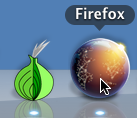
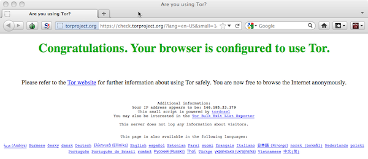

.. _submission:

================
Submission Guide
================

Are you a whistleblower interested in submitting documents to Honest Appalachia? This document will guide you through submitting a file to our secure upload site.

You will need:

1.  A file or files to share with us
2.  A computer with internet access that you can install software on. Any common platform (Windows, Mac, Linux...) will work.

We recommend *not* making submissions or even accessing this site over corporate or organizational networks. Your network traffic is almost certainly being recored, and if it is not being actively analyzed, it will be once leaked documents appear. Furthermore, many such networks block or ban the use of anonymization software like Tor, which is required to access our secure upload server.

Instead, copy the files to a flash drive or CD-ROM and upload them from there to our website, using a personal or public computer. You will need to install software, so it is likely that many publicly available computers (at libraries or internet cafes, for example) will not be suitable either. Use your own computer, or borrow a friend's. Using a laptop on a public wifi network, like those provided by libraries or coffee shops, is a good idea as long as you use secure connections, and especially if you use anonymization software like Tor. 

The secure submission process and this guide to it are designed to be easy to use no matter your technical skill level! If, however, you run into problems, feel free to :ref:`contact`.

Prepare the Files
-------------------

For security reasons, the upload site limits the size and type of files you can upload. At the moment, you can upload files up to 500MB in size in a variety of common document formats. The full list is here:

1.  PDF (.pdf)
2.  Microsoft Office (Word, Excel, or Powerpoint) (.doc, .docx, .xls, .xlsx, .ppt, .pptx)
3.  Open Document Format (.odf)
4.  Compressed files and file archives (.zip, .rar, .tar, .tar.gz)
5.  Plain text (.txt, .rtf)

If you want to upload related files, we recommend combining them into a compressed archive.

Download and Install the Tor Browser Bundle
-------------------------------------------

Tor is free, open source software that is widely used by activists around the world to protect their identities and evade censorship and surveillance online. It works by encrypting your web traffic and routing it through a series of relay computers run by volunteers around the world. Best of all, it is easy to install and use. We recommend using the Tor Browser Bundle, a package that contains a modified version of the Firefox web browser configured to use Tor. 

First, download the browser bundle from the Tor Project's site: https://www.torproject.org/download/download-easy.html.en. Unpack the downloaded file, and you should see a file called something similar to "TorBrowser_en-US", with an icon that looks like an onion.

..  image:: images/TorBrowserBundleIconsMac.png
    :align: center

..  note::
    If these instructions were confusing (unpack?), read the step-by-step instructions for your operating system:

    1.  Windows: https://www.torproject.org/projects/torbrowser.html.en#Windows
    2.  Mac OS X: https://www.torproject.org/projects/torbrowser.html.en#MacOSX
    3.  Linux: https://www.torproject.org/projects/torbrowser.html.en#Linux

Double-click on this file. It will launch an application called Vidalia, which is a graphical frontend to the Tor software. Vidalia will automatically try to connect to the Tor network.

..  image:: images/VidaliaControlPanelMac.png
    :align: center

If Vidalia successfully connects (this may take a little while), you will see the window above, saying "Connected to the Tor network!" with a green onion icon.

..  note::
    Although Vidalia is usually able to figure out how to connect without any problems, if you encounter any issues in connecting, try the steps outlined here: https://www.torproject.org/dist/manual/short-user-manual_en.xhtml#what-to-do-when-tor-does-not-connect

After Vidalia connects to the Tor Network, it will automatically launch a web browser. The browser's name may be Firefox or Aurora, but either way it is just a modified version of the popular open-source Firefox web browser.

The browser will automatically open https://check.torproject.org/, a website that checks to see if the browser's traffic is successfully being routed through Tor. If you see a page with "Congratulations. Your browser is configured to use Tor" in green text, you're good to go!

Upload files to the secure upload site
--------------------------------------

Go to the Honest Appalachia upload page in the Tor browser: https://www.honestappalachia.org/upload/. This page will also check that your traffic is being anonymized by Tor. If it is, you will be automatically redirected to our secure upload page; otherwise, you will get a warning page with a link to this documentation.

The upload site is a simple form with two fields. Choose the file to upload with the first field. The second field is a text area, where you can optionally include comments about the file. Comments about where a file came from, what it refers to, or why it is important are all highly useful to us. 

..  warning::
    Don't include any personally identifying information, either in the files you upload or in the comment. We are working on a secure system to help people track the progress of their files through our system, but it is incomplete at the moment.

When you're done, click the "Upload" button. The file and comment will be uploaded to our secure server. 

..  note::
    Doing stuff over Tor is *slow*. Depending on the size of your file and your connection, it can take over an hour to upload your files. Do not cancel the download, hit the back button, or close the browser until you see the confirmation page. 

..  tip::
    If you want to monitor the progress of your upload, go to the Vidalia Control Panel *before you start the upload* and open the **Bandwidth Graph**. Click the "Reset" button in the bottom right corner of the window.

    ..  image:: images/VidaliaTorBandwithUsageMac.png
        :align: center

    Leaving the Bandwidth Graph window open, click the Upload button on the upload page. You can now easily monitor the progress of your upload, complete with a cool graph.

Cleanup
-------

After you've successfully uploaded your files to our secure server, you're almost done! We will receive your files, remove any metadata we find, and share them with journalists and/or the public.

Your last step should be covering your tracks. At this point, the worst thing that could happen is the police using a search warrant to seize your computer equipment. Finding confidential files that may or not may have official access to, especially if those files were just leaked by a website, would be suspicious. Software like Tor, although legal, might also be considered suspicious.

Securely Delete Files
^^^^^^^^^^^^^^^^^^^^^

If you stored your files on an erasable medium, like a hard drive or a flash drive, you will not be safe if you just drag those files to the Trash/Recycle Bin and empty it, or just rm them on a Linux system. That's because on most modern computer systems, when you "delete" a file, you really haven't. Instead, the operating system makes the file invisible and marks the part of the drive it is stored on as "empty", meaning other files can now be written over. This design is what allows people to recover accidentally deleted files - but computer forensics teams working for law enforcement can use these same techniques to work against you, recovering files that may then be used as evidence.

Your best bet is to securely delete these files. Link to SSD page, which has info for Windows, Mac, and Linux, or write about all of it here?

Destroy Physical Media
^^^^^^^^^^^^^^^^^^^^^^

If the media you copied files with is *not* rewritable - for example, a CD-ROM - you will need to physically destroy it. You can do the same thing you do with paper - shred 'em, and throw 'em away. There are inexpensive shredders that will chew up CD-ROMs. Never just toss a CD-ROM out in the garbage unless you're absolutely sure there's nothing sensitive on it. (last bit copied wholesale from SSD)

